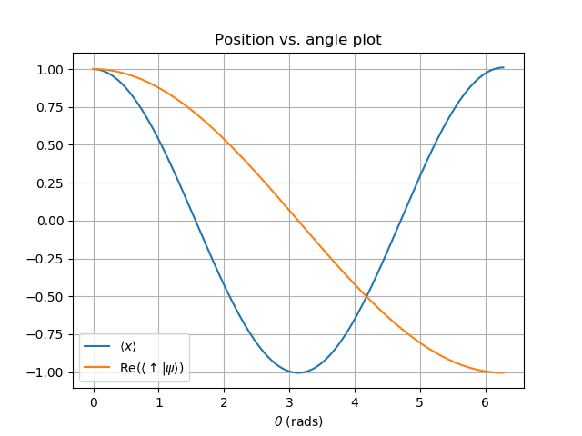

Complex Matrix Example Code
===

Based off my code at [my website](http://dkmoore.physics.ucsd.edu/2018-04-16/Matrix/)

Compilation instructions: 
---

`g++ -o main main.cpp` takes main.cpp, compiles it into a program, and saves it to a file called "main".

`./main > out.txt` runs main, and pipes all of its text output to a file called out.txt.

`python plot.py` runs the python file plot.py, which outputs an image of the wavefunction over time.

You should see the following image generated:

Physics of what's going on
---

Makefile instructions
---

I won't be using the makefile in class, but it wraps up all the commands nicely so that it's easy to run over and over again.

Type "make" to compile the c++ file.

Type "make run" to compile, run, and plot the code.

Type "make clean" to delete the executable, plot, and output data.

